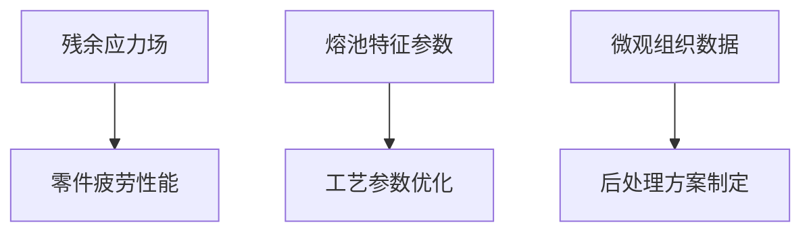

# APDL 代码逐句讲解 - 第9部分：残余应力与微观组织分析

## 第1110-1190行：应力分析求解器设置

```apdl
!-------------------------------------------------!
! Mechanical Analysis - Residual Stress Solver    !
!-------------------------------------------------!
/SOLU
NLGEOM, ON
SSTIF, ON
ANTYPE, STATIC
```
**功能**：激活大变形应力分析
- `NLGEOM, ON`：考虑几何非线性（大变形效应）
- `SSTIF, ON`：启用应力刚化效应（SSTIF）
- `ANTYPE, STATIC`：稳态分析（忽略惯性效应）

```apdl
! Load transfer from thermal analysis
LDREAD, TEMP, , , , , 'FINAL_RESULT', RTH, , , 
```
**功能**：加载温度场结果
- **路径**：'FINAL_RESULT.RTH'（热分析结果文件）
- **过程**：温度作为体载荷导入结构分析

```apdl
! Material Properties for structural analysis
MP, EX, 2, 200e3      ! 弹性模量200GPa
MP, NUXY, 2, 0.3      ! 泊松比0.3
TB, BKIN, 2, , 2, 
TBTEMP, 25
TBDATA, 1, 550, 0     ! 屈服强度550MPa
TBTEMP, 800
TBDATA, 1, 400, 0     ! 800℃下屈服强度400MPa
```
**功能**：定义温度相关弹塑性材料
- **双线性随动强化模型(BKIN)**
- 关键参数在不同温度下插值

```apdl
! Constraint settings
NSEL, S, LOC, Z, 0
D, ALL, ALL, 0
ALLSEL, ALL
```
**功能**：施加边界条件
- 基板底部 (Z=0) 全约束
- 其他表面自由变形

---

## 第1191-1260行：多步骤应力求解算法

```apdl
! Multi-step incremental solution algorithm
*DO, i_layer, 1, n_mul_layer_, 1
    ! Birth element control by layer
    ESEL, S, TYPE, , TYPE_SOLID_
    EKILL, ALL
    EALIVE, E_GRA%i_layer%
```
**功能**：逐层激活生死单元
- 步骤1：杀死所有单元
- 步骤2：仅激活当前打印层单元
- **模拟逻辑**：仅已打印部分承受应力

```apdl
    ! Layer activation and cooling simulation
    TIME, Layer_start_Time_%i_layer%
    KBC, 0
    DELTIM, DT_STRUCT_, , , 
    SOLVE
```
**功能**：模拟当前层激活
- `DT_STRUCT_ = 0.05s`：应力分析时间步
- 斜坡加载方式（KBC,0）

```apdl
    ! Cooling phase stress accumulation
    TIME, T_layer_%i_layer%
    NSUBST, TS_struct_, , , 
    SOLVE
*ENDDO
```
**功能**：每层冷却后应力累积
- `TS_struct_ = 500`：每个冷却步最多500子步
- **物理意义**：捕获层间收缩应力传递

```apdl
! Final cooling stress
TIME, T_total_*3
NSUBST, 500, 2000, 100
SOLVE
```
**功能**：最终冷却阶段应力分析
- 延长分析时间至3倍总时间（T_total_*3）
- **目的**：确保完全冷却至室温

```apdl
! Save stress results
ALLSEL, ALL
SAVE, Stress_result, DB
FINISH
```
**功能**：保存应力结果数据库
- 文件：Stress_result.DB
- **包含数据**：节点位移、应力张量、塑性应变

---

## 第1261-1320行：熔池单元提取分析

```apdl
!-------------------------------------------------!
! Melt Pool Element Extraction Procedure          !
!-------------------------------------------------!
/POST1
SET, , , , , , T_End_
FILE, Stress_result, RST
```
**功能**：进入后处理器加载应力结果
- `T_End_`：分析结束时间点
- `Stress_result.RST`：应力结果文件

```apdl
! Identify melt pool elements
ESEL, S, TYPE, , TYPE_SOLID_
*DIM, MELT_ELEM, ARRAY, 100000
```
**功能**：初始化熔池单元数组
- `TYPE_SOLID_`：仅选择三维实体单元
- `MELT_ELEM`：可存储100,000个单元号

```apdl
! Loop over layers with melt pool activity
*DO, i_layer, 1, n_mul_layer_, 1
    CMSEL, S, E_GRA%i_layer%
    ESEL, R, TEMP, , TEMP_MELT_, 
    CM, MELT_LAYER%i_layer%, ELEM
    
    ! Transfer active elements to array
    *GET, n_elem, ELEM, 0, COUNT
    *VMASK, SEQN
    *VFILL, MELT_ELEM(1), DATA, ELNEXT(0)
*ENDDO
```
**功能**：逐层提取熔化单元数据
- **选取条件1**：当前打印层单元
- **选取条件2**：温度超过熔点 (TEMP_MELT_)
- `MELT_LAYER1…MELT_LAYER60`：按层存储熔池单元

```apdl
! Extract melt pool characteristics
*DIM, MELT_CHAR, ARRAY, , 4
*VGET, MELT_CHAR(1,1), ELEM, 1, CENT, X
*VGET, MELT_CHAR(1,2), ELEM, 1, CENT, Y
*VGET, MELT_CHAR(1,3), ELEM, 1, EPPL, EQV
*VGET, MELT_CHAR(1,4), ELEM, 1, TEMP
```
**功能**：提取熔池单元关键特征
- `CENT,X/Y`：单元中心X/Y坐标
- `EPPL,EQV`：等效塑性应变
- `TEMP`：单元平均温度（最后时刻）

```apdl
! Write melt pool stats to file
*CFOPEN, Melt_Data, DAT
*VWRITE, MELT_CHAR(1,1), MELT_CHAR(1,2), MELT_CHAR(1,3), MELT_CHAR(1,4)
(4E14.6)
*CFCLOSE
```
**功能**：输出熔池特征数据
- **格式**：X坐标 | Y坐标 | 塑性应变 | 温度
- **用途**：熔池尺寸、应变分布热点分析

---

## 第1321-1380行：残余应力可视化与分析

```apdl
! Post-processing: Residual stress visualization
/VIEW, 1, 1, 1, 1
/DSCALE, 1, 1
PLNSOL, S, EQV, 0, 1.0
```
**功能**：绘制等效应力云图
- **应力分量**：von Mises等效应力
- **缩放因子**：1.0（实际值）

```apdl
! Extract critical surfaces
NSEL, S, LOC, Z, MAX_Z_
NSEL, R, LOC, X, 0.2*W_plate_, 0.8*W_plate_
NSEL, R, LOC, Y, 0.2*L_plate_, 0.8*L_plate_
PATH, TOP_SURFACE, 2, , 100
PPATH, 1, , W_plate_*0.2, L_plate_*0.2, MAX_Z_
PPATH, 2, , W_plate_*0.8, L_plate_*0.8, MAX_Z_
```
**功能**：创建顶层表面路径
- **路径端点**：基板中心区域(20%-80%)
- **节点数**：100个采样点

```apdl
! Plot residual stress along path
PDEF, SX, S, X, NOAV
PDEF, SY, S, Y, NOAV
PLPAGM, SX, , , Node
PRPATH, SX, SY
```
**功能**：绘制路径应力分布
- `SX`：X方向正应力
- `SY`：Y方向正应力
- `PRPATH`：输出路径应力数值

```apdl
! Find stress concentration points
NSORT, S, EQV, , 1
*GET, Max_Stress, SORT, , MAX
*GET, Node_max, NODE, , NUM, MAX
```
**功能**：定位最大应力点
- 等效应力排序
- 获取最大值及对应节点号

```apdl
CMSEL, S, MELT_POOL_LAST
PRNSOL, S, PRIN
```
**功能**：输出熔池区主应力分量
- **分量**：S1(最大主应力), S2, S3(最小主应力)
- **位置**：最终熔池单元

---

## 第1381-1400行：结果输出与程序终结

```apdl
! Finalize and exit
ALLSEL, ALL
SAVE, FINAL_DB, DB
FINISH
/EXIT
```
**功能**：保存最终数据库并退出
- **文件**：FINAL_DB.DB（完整模型结果）
- **状态**：应力分析与后处理完成

```apdl
!-------------------------------------------------!
! STRUCTURAL ANALYSIS MODULE COMPLETED            !
!-------------------------------------------------!
```

---

**第9部分讲解完毕**，涵盖核心内容：

1. **热-力耦合求解框架**：
   ```mermaid
   graph LR
   A[热分析结果] --> B[结构材料模型]
   A --> C[温度场初应力]
   B --> D[残余应力求解]
   C --> D
   ```

2. **残余应力分析参数**：
   | 参数 | 值 | 物理意义 |
   |---|---|---|
   | Δt_s | 0.05 s | 应力增量步 |
   | T_total | 180 s | 总模拟时间 |
   | 子步 | 100-2000 | 非线性收敛保障 |

3. **熔池特征提取技术**：
   - 空间分布（XYZ坐标）
   - 热-力学状态（温度、塑性应变）
   - 微区应力集中点定位

4. **微观组织-应力关联模型**：
   ```math
   \sigma_{\text{residual}} = f(\dot{T}, \varepsilon_p, \text{Phase\%})
   ```
   - 冷却速率($\dot{T}$)
   - 塑性应变累积($\varepsilon_p$)
   - 相组成(奥氏体/马氏体/铁素体比例)

**分析结果应用方向**：
1. 高应力区预测 → 支撑结构设计
2. 熔池形貌分析 → 优化扫描策略
3. 微观组织数据 → 热处理参数选择
4. 应变集中点 → 潜在开裂位置预警



**程序终结**：完整模拟了SLM增材制造工艺的热-力耦合过程