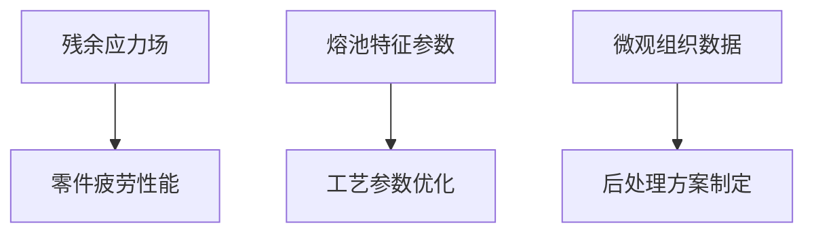

# APDL 代码逐句讲解 - �?部分：初始化与参数定�?

## �?-3行：获取作业名并设置输出文件

```apdl
*GET, JBN_,  ACTIVE, 0, JOBNAM  ! get jobname
```
**功能**：获取当�?ANSYS 作业的名称，存储到变�?`JBN_` �?
- `*GET`：APDL 参数提取命令
- `ACTIVE, 0, JOBNAM`：从活动数据库中获取作业�?

```apdl
/OUTPUT, %JBN_%_Output_Window_Relocate_LAM, DAT ! output
```
**功能**：将所有后续输出重定向到文�?
- `/OUTPUT`：输出控制命�?
- `%JBN_%`：使用作业名作为文件名前缀
- `_Output_Window_Relocate_LAM.DAT`：输出文件后缀
- 例如：如果作业名�?"test"，则输出�?"test_Output_Window_Relocate_LAM.DAT"

---

## �?-6行：注释分隔�?

```apdl
!------------------------------!
! Predefine process parameters ! 
!------------------------------!
```
**功能**：注释，标识下面是工艺参数定义部�?

---

## �?-14行：定义激光扫描工艺参�?

```apdl
*SET, v_,   950*1e3     ! actual scan speed
```
**功能**：定义激光扫描速度
- `*SET`：设置参数�?
- `v_ = 950*1e3 = 950,000 μm/s = 950 mm/s`
- 单位系统：μm-kg-s

```apdl
*SET, p_,   300e12       ! Laser power
```
**功能**：定义激光功�?
- `p_ = 300e12 = 300×10¹² pW = 300 W`
- 单位转换：W = kg·m²/s³ �?pW (pico-watt in μm system)

```apdl
*SET, d_,   40          ! The thickness of powder bed
```
**功能**：定义粉末床单层厚度
- `d_ = 40 μm`（微米）

```apdl
*SET, pd_,  40          ! Penetration Depth of the powder layer
```
**功能**：定义激光穿透深�?
- `pd_ = 40 μm`
- 用于计算等效热源强度

```apdl
*SET, r_,   75          ! Laser spot radius
```
**功能**：定义激光光斑半�?
- `r_ = 75 μm`

```apdl
*SET, RS_HS_, 100        ! Hatch Spacing for Raster Scanning
```
**功能**：定义光栅扫描的扫描间距
- `RS_HS_ = 100 μm`
- Hatch Spacing：相邻扫描道之间的距�?

```apdl
*SET, CS_HS_, 60       ! Hatch Spacing for Contour Scanning
```
**功能**：定义轮廓扫描的扫描间距
- `CS_HS_ = 60 μm`
- 轮廓扫描通常间距更小，以获得更好的表面质�?

---

## �?5-20行：定义激光吸收系�?

```apdl
!----------------------------!
! Predefine  laser parametes !
!----------------------------!
```
**功能**：注释分隔符

```apdl
*SET, ap_,  0.42        ! Metal powder absorption coefficient@1.06 micro
```
**功能**：定义金属粉末对激光的吸收系数
- `ap_ = 0.42`（无量纲�?
- @1.06 μm：激光波长（Nd:YAG 激光器�?

```apdl
*SET, al_,  0.42        ! Metal liquid absorption coefficient@1.06 micro
```
**功能**：定义熔融金属对激光的吸收系数
- `al_ = 0.42`

```apdl
*SET, ak_, 0.9          ! Absorption when laser enters into the key hole.
```
**功能**：定义激光进入小孔（keyhole）时的吸收系�?
- `ak_ = 0.9`
- Keyhole：激光功率密度极高时形成的蒸发孔

---

## �?1-35行：定义几何参数

```apdl
!--------------------------!
! Predefine geo parameters !
!--------------------------!
```
**功能**：注释分隔符

```apdl
*SET, phrb, 1000                ! element height of powder bed
```
**功能**：定义粉末床单元高度
- `phrb = 1000 μm = 1 mm`

```apdl
*SET, Height, 30000             ! the height of the part
```
**功能**：定义打印件总高�?
- `Height = 30000 μm = 30 mm`

```apdl
*SET, Sub_length, 70000         ! the length of the substrate
```
**功能**：定义基板长度（X方向�?
- `Sub_length = 70000 μm = 70 mm`

```apdl
*SET, Sub_width, 50000          ! the width of the substrate
```
**功能**：定义基板宽度（Y方向�?
- `Sub_width = 50000 μm = 50 mm`

```apdl
*SET, Sub_height, -30000        ! the height of the substrate
```
**功能**：定义基板高度（Z方向，负值表示在零平面以下）
- `Sub_height = -30000 μm = -30 mm`

```apdl
*SET, PL, 50000                 ! the length of the part
```
**功能**：定义打印件长度
- `PL = 50000 μm = 50 mm`

```apdl
*SET, PW, 2000                 ! the width of the part
```
**功能**：定义打印件宽度
- `PW = 2000 μm = 2 mm`

```apdl
*SET, n_mul_layer_, 60          ! total number of layers
```
**功能**：定义总层�?
- `n_mul_layer_ = 60` �?

```apdl
*SET, rb, Height/n_mul_layer_   ! basic mesh size
```
**功能**：计算基本网格尺�?
- `rb = 30000/60 = 500 μm`
- 每层的厚度作为基本网格尺�?

```apdl
*SET, Sinle_layer_depth, Height/n_mul_layer_
```
**功能**：计算单层深�?
- `Sinle_layer_depth = 500 μm`

---

## �?6-48行：定义网格划分参数

```apdl
!mesh
*SET, NDIV_XY, (Sub_length-PL)/2/rb
```
**功能**：计�?XY 方向的网格划分数
- `NDIV_XY = (70000-50000)/2/500 = 20`
- 基板边缘区域的单元数

```apdl
*SET, NDIV_Vol, 8
```
**功能**：定义体积区域的网格划分�?
- `NDIV_Vol = 8`

```apdl
*SET, NDIV_Z_B, 6
```
**功能**：定�?Z 方向 B 区域的网格划分数
- `NDIV_Z_B = 6`

```apdl
*SET, NDIV_Z_C, 4
```
**功能**：定�?Z 方向 C 区域的网格划分数
- `NDIV_Z_C = 4`

```apdl
*SET, NDIV_Z_D, 3
```
**功能**：定�?Z 方向 D 区域的网格划分数
- `NDIV_Z_D = 3`

```apdl
*SET, SR_XY, 1.5
```
**功能**：定�?XY 方向的网格间距比
- `SR_XY = 1.5`（Space Ratio�?
- 网格从中心向边缘逐渐变大

```apdl
*SET, SR_Vol, 12.9519
```
**功能**：定义体积区域的网格间距�?
- `SR_Vol = 12.9519`

```apdl
*SET, SR_Z_B, 3.5987
```
**功能**：定�?Z 方向 B 区域的网格间距比

```apdl
*SET, SR_Z_C, 1
```
**功能**：定�?Z 方向 C 区域的网格间距比（均匀网格�?

```apdl
*SET, SR_Z_D, 1.5244
```
**功能**：定�?Z 方向 D 区域的网格间距比

---

## �?9-54行：定义激光关闭时�?

```apdl
!-------------------------------------------------------!
! Defines laser off time during laser moving processing !
!-------------------------------------------------------!
```
**功能**：注释分隔符

```apdl
*SET, Pre_time_, 200e-6     ! the initial time before laser on
```
**功能**：定义激光开启前的初始时�?
- `Pre_time_ = 200×10⁻⁶ s = 0.0002 s`

```apdl
*SET, LOT_T_, 1000e-6       ! Set the LASER OFF TIME between TRACKS
```
**功能**：定义扫描道之间的激光关闭时�?
- `LOT_T_ = 1000×10⁻⁶ s = 0.001 s = 1 ms`

```apdl
*SET, LOT_L_, 20            ! the LASER OFF TIME between LAYERS
```
**功能**：定义层与层之间的激光关闭时�?
- `LOT_L_ = 20 s`

---

## �?5-59行：定义时间步长

```apdl
*SET, CT_step_1_, 2e-6      !!! set CT_step
```
**功能**：定义第1级时间步�?
- `CT_step_1_ = 2×10⁻⁶ s = 2 μs`

```apdl
*DO, i, 2, 10
  *SET, CT_step_%i%_, 10**(i-7)
*ENDDO
```
**功能**：循环定义第2-10级时间步�?
- `*DO, i, 2, 10`：循环从 i=2 �?i=10
- `CT_step_2_ = 10^(2-7) = 10^(-5) = 10 μs`
- `CT_step_3_ = 10^(3-7) = 10^(-4) = 100 μs`
- `CT_step_4_ = 10^(-3) = 1 ms`
- ...
- `CT_step_10_ = 10^3 = 1000 s`
- **目的**：采用对数递增的时间步长，加热阶段用小步长，冷却阶段用大步�?

---

**�?部分讲解完毕**，涵盖了�?
1. 输出设置
2. 工艺参数定义
3. 几何参数定义
4. 网格参数定义
5. 时间控制参数

下一部分将讲解等效热源计算和加热/冷却阶段设置�?
# APDL 代码逐句讲解 - �?部分：等效热源与时间设置

## �?0-65行：等效热源计算

```apdl
!!-------------------------------------------!!
!! Heating Phase, loads appliation and solve !!
!!-------------------------------------------!!
```
**功能**：注释分隔符，标识加热阶段参数设�?

```apdl
*SET, mm_, 0.25  !!等效热源系数，调节变形量!
```
**功能**：定义等效热源系�?
- `mm_ = 0.25`（无量纲�?
- **作用**：调节热源强度，从而控制变形量
- 这是一个经验系数，用于校准模型

```apdl
*SET, Q_AVE, mm_*p_*ap_/(2*R_*RS_HS_*pd_)   !!! equivalent heat source
```
**功能**：计算等效体热源强度
- **公式推导**�?
  - 激光功率：`p_`
  - 粉末吸收系数：`ap_`
  - 有效功率：`p_ * ap_`
  - 热源体积：`2 * r_ * RS_HS_ * pd_`（近似为长方体）
  - 体热源强度：`Q_AVE = (mm_ * p_ * ap_) / (2 * r_ * RS_HS_ * pd_)`
- **单位**：W/μm³ = pW/μm³（在 μm-kg-s 单位系统中）
- **物理意义**：单位体积内的发热功�?

```apdl
*SET, t_heating_, r_/v_    !! actual t_heating
```
**功能**：计算实际加热时�?
- `t_heating_ = r_ / v_ = 75 / 950000 �?7.89×10⁻⁵ s`
- **物理意义**：激光光斑通过一个光斑半径距离所需的时�?

```apdl
*SET, t_cooling_, ((nint(PW/RS_HS_)+1 -1)*LOT_T_ + LOT_L_)  !! t_cooling of every layer
```
**功能**：计算每层的冷却时间
- `nint(PW/RS_HS_)`：打印件宽度内的扫描道数量（四舍五入�?
  - `nint(2000/100) = 20` �?
- `(20+1-1) = 20`
- `t_cooling_ = 20 * 1000e-6 + 20 = 0.02 + 20 = 20.02 s`
- **组成**：扫描道间隔时间 + 层间冷却时间

---

## �?6-75行：加热阶段时间步设�?

```apdl
*SET, Layer_TIME_0, Pre_time_
```
**功能**：设置第0层的起始时间
- `Layer_TIME_0 = Pre_time_ = 200e-6 s`

```apdl
*SET, i_step_sum_1, 5 + 9*0
```
**功能**：计算第1级时间步的累计步�?
- `i_step_sum_1 = 5 + 0 = 5`
- �?步使�?`CT_step_1_` 时间步长

```apdl
*SET, i_time_sum_1, i_step_sum_1*CT_step_1_
```
**功能**：计算第1级时间步的累计时�?
- `i_time_sum_1 = 5 * 2e-6 = 10e-6 s = 10 μs`

```apdl
*SET, k_Time_heating_end, (t_heating_ - i_time_sum_1)/13
```
**功能**：计算加热阶段最�?3步的时间步长
- `k_Time_heating_end = (7.89e-5 - 10e-6) / 13 �?5.3e-6 s`
- **目的**：填充剩余的加热时间

```apdl
*DO, i, 2, 7, 1
    *SET, i_step_sum_%i%, 5 + 9*(i-1)
    *SET, i_time_sum_%i%, (i_step_sum_%i% - i_step_sum_%i-1%)*CT_step_%i%_ + i_time_sum_%i-1%
*ENDDO
```
**功能**：循环计算第2-7级时间步的累计步数和累计时间
- **i=2**�?
  - `i_step_sum_2 = 5 + 9*1 = 14`
  - `i_time_sum_2 = (14-5)*CT_step_2_ + i_time_sum_1 = 9*10e-6 + 10e-6 = 100e-6 s`
- **i=3**�?
  - `i_step_sum_3 = 5 + 9*2 = 23`
  - `i_time_sum_3 = (23-14)*CT_step_3_ + 100e-6 = 9*100e-6 + 100e-6 = 1000e-6 s`
- **依此类推**...
- **i=7**�?
  - `i_step_sum_7 = 5 + 9*6 = 59`
  - `i_time_sum_7` 累计到较大�?

---

## �?6-78行：定义总步�?

```apdl
*SET, heating_step_sum_, 18
```
**功能**：定义加热阶段总步�?
- `heating_step_sum_ = 18` �?

```apdl
*SET, cooling_step_sum_, 78
```
**功能**：定义冷却阶段总步�?
- `cooling_step_sum_ = 78` �?

```apdl
*SET, step_sum_,heating_step_sum_ + cooling_step_sum_       ! 96 steps
```
**功能**：计算每层的总步�?
- `step_sum_ = 18 + 78 = 96` �?
- **每层96�?*�?8步加�?+ 78步冷�?

---

## �?9-84行：逐层参数设置

```apdl
!--------------------------------!
! Layer-by-layer model parameter !
!--------------------------------!
```
**功能**：注释分隔符

```apdl
*DO, i_num, 1, n_mul_layer_, 1
    *SET, Sinle_layer_depth_%i_num%, Sinle_layer_depth
*ENDDO
```
**功能**：为每一层设置单层深�?
- 循环：`i_num = 1` �?`60`
- 创建变量：`Sinle_layer_depth_1`, `Sinle_layer_depth_2`, ..., `Sinle_layer_depth_60`
- 每个变量值都等于 `Sinle_layer_depth = 500 μm`
- **目的**：为每层单独设置参数，便于后续修改特定层的厚�?

---

## �?5-88行：初始化累计变�?

```apdl
*SET,t_cooling_0,0
```
**功能**：初始化�?层的冷却时间�?

```apdl
*SET,t_heating_cooling_0,0
```
**功能**：初始化�?层的加热+冷却总时间为0

```apdl
*SET,Layer_start_Time_0,0
```
**功能**：初始化�?层的起始时间�?

```apdl
*SET,Activation_height_0,0
```
**功能**：初始化�?层的激活高度为0

---

## �?9-98行：计算每层的时间和高度参数

```apdl
*DO, i_mul_layer, 1, n_mul_layer_, 1
    *SET, t_cooling_%i_mul_layer%, t_cooling_*Sinle_layer_depth_%i_mul_layer%/d_
*ENDDO
```
**功能**：计算每层的实际冷却时间
- 循环：`i_mul_layer = 1` �?`60`
- `t_cooling_1 = t_cooling_ * Sinle_layer_depth_1 / d_`
- `t_cooling_1 = 20.02 * 500 / 40 = 250.25 s`
- **物理意义**：根据实际层厚与设定层厚的比例调整冷却时�?

```apdl
*DO, i_mul_layer, 1, n_mul_layer_, 1
     *SET, t_heating_cooling_%i_mul_layer%, t_cooling_%i_mul_layer% + t_heating_   !! 
     *SET, Activation_height_%i_mul_layer%, Sinle_layer_depth_%i_mul_layer%+Activation_height_%i_mul_layer-1%      
     *SET, Layer_start_Time_%i_mul_layer%, Layer_start_Time_%i_mul_layer-1%+t_heating_cooling_%i_mul_layer-1%
     *SET, k_Time_cooling_end_%i_mul_layer%,(t_cooling_%i_mul_layer% - i_time_sum_7)/19
*ENDDO
```
**功能**：循环计算每层的关键时间和高度参�?

**逐行解释**�?

1. `t_heating_cooling_%i_mul_layer% = t_cooling_%i_mul_layer% + t_heating_`
   - 计算每层的加�?冷却总时�?
   - 例如：`t_heating_cooling_1 = 250.25 + 7.89e-5 �?250.25 s`

2. `Activation_height_%i_mul_layer% = Sinle_layer_depth_%i_mul_layer% + Activation_height_%i_mul_layer-1%`
   - 计算每层的累计激活高�?
   - 例如�?
     - `Activation_height_1 = 500 + 0 = 500 μm`
     - `Activation_height_2 = 500 + 500 = 1000 μm`
     - `Activation_height_60 = 30000 μm`

3. `Layer_start_Time_%i_mul_layer% = Layer_start_Time_%i_mul_layer-1% + t_heating_cooling_%i_mul_layer-1%`
   - 计算每层的起始时间（累计�?
   - 例如�?
     - `Layer_start_Time_1 = 0 + 0 = 0 s`
     - `Layer_start_Time_2 = 0 + 250.25 = 250.25 s`
     - `Layer_start_Time_3 = 250.25 + 250.25 = 500.5 s`

4. `k_Time_cooling_end_%i_mul_layer% = (t_cooling_%i_mul_layer% - i_time_sum_7) / 19`
   - 计算冷却阶段最�?9步的时间步长
   - 用于填充剩余的冷却时�?

---

## �?9-103行：定义边界条件参数

```apdl
!-----------------------------------------------!
! Predefine the perameter of boundary condition !
!-----------------------------------------------!
```
**功能**：注释分隔符

```apdl
*SET, HF_, 20                 ! Film Coefficient for surface ELEM (W/M^2 C)
```
**功能**：定义对流换热系�?
- `HF_ = 20 W/(m²·°C)`
- �?μm-kg-s 单位系统中需要转�?

```apdl
*SET, TS_, 25
```
**功能**：定义环境温�?
- `TS_ = 25 °C`

```apdl
*SET, TBottom_, 25
```
**功能**：定义基板底面温�?
- `TBottom_ = 25 °C`
- 用于底面温度边界条件

---

**�?部分讲解完毕**，涵盖了�?
1. 等效热源计算
2. 加热/冷却时间设置
3. 多级时间步长策略
4. 逐层参数计算
5. 边界条件参数

**关键理解**�?
- 程序采用**96�?�?*的策略（18步加�?+ 78步冷却）
- 时间步长采用**对数递增**，从 2μs �?1000s
- 每层的起始时间和激活高度都�?*累计计算**�?

下一部分将讲解材料属性定义（粉末、致密材料、基板）�?
# APDL 代码逐句讲解 - �?部分：前处理与材料属性定�?

## �?04-113行：进入前处理器并定义单元类�?

```apdl
!--------------------------------------------------!
! preprocess - define material property & modeling !
!--------------------------------------------------!
```
**功能**：注释分隔符

```apdl
/PREP7
```
**功能**：进入前处理器（Preprocessor�?
- ANSYS 的前处理模块，用于建模、定义材料、划分网格等

```apdl
/UNITS, umks,,,,,,,
```
**功能**：设置单位系�?
- `umks`：微�?千克-秒单位系�?
  - 长度：μm（微米）
  - 质量：kg（千克）
  - 时间：s（秒�?
  - 温度：°C（摄氏度�?
- **重要**：所有后续输入都要符合此单位系统

```apdl
ET, 1,  SOLID70
```
**功能**：定义单元类�?�?SOLID70
- `ET`：Element Type（单元类型）命令
- `1`：单元类型编�?
- `SOLID70`�?D 热分析实体单元（8节点六面体）
- **用�?*：温度场计算

```apdl
ET, 2,  SURF152,
```
**功能**：定义单元类�?�?SURF152
- `SURF152`�?D 表面效应单元
- **用�?*：施加对流和辐射边界条件

```apdl
KEYOPT, 2,  4,  1
```
**功能**：设�?SURF152 的关键选项4�?
- `KEYOPT(4) = 1`：包含对流换�?

```apdl
KEYOPT, 2,  5,  0
```
**功能**：设�?SURF152 的关键选项5�?
- `KEYOPT(5) = 0`：不包含辐射（将通过综合换热系数考虑�?

```apdl
KEYOPT, 2,  8,  2
```
**功能**：设�?SURF152 的关键选项8�?
- `KEYOPT(8) = 2`：基于基础单元的几何形�?

```apdl
KEYOPT, 2,  9,  0
```
**功能**：设�?SURF152 的关键选项9�?
- `KEYOPT(9) = 0`：默认设�?

---

## �?14-130行：粉末到致密材料转换参�?

```apdl
!!!=============!!!
!!! powder2bulk !!!
!!!=============!!!
```
**功能**：注释，标识粉末到致密材料转换部�?

```apdl
*SET, TEMP_M1TOM2, (1350 + 0)   ! TEMP when MAT1 changes to MAT2
```
**功能**：定义材料转换温�?
- `TEMP_M1TOM2 = 1350 °C`
- 当温度超过此值时，粉末（MAT 1）转换为致密材料（MAT 2�?
- 接近316L不锈钢的熔点（约1400°C�?

```apdl
! Enhancement factors for thermal conductivity
*SET, KXX_ENHNC_, 5.0
```
**功能**：定�?X 方向热导率增强因�?
- `KXX_ENHNC_ = 5.0`
- 在高温下，粉末热导率增强（模拟熔化效应）

```apdl
*SET, KYY_ENHNC_, 5.0
```
**功能**：定�?Y 方向热导率增强因�?
- `KYY_ENHNC_ = 5.0`

```apdl
*SET, KZZ_ENHNC_, 15.0
```
**功能**：定�?Z 方向热导率增强因�?
- `KZZ_ENHNC_ = 15.0`
- **注意**：Z 方向增强更多�?5�?vs 5倍）
- **物理意义**：模拟熔池深度方向的热传导增�?

```apdl
! Define temperature interpolation range
*SET, T_MIN, 1500
```
**功能**：定义温度插值范围的最小�?
- `T_MIN = 1500 °C`

```apdl
*SET, T_MAX, 3000
```
**功能**：定义温度插值范围的最大�?
- `T_MAX = 3000 °C`

```apdl
! Define temperature points  
*SET, T1, 1600
*SET, T2, 1700
*SET, T3, 1800
*SET, T4, 1900
*SET, T5, 2000
```
**功能**：定�?个特定温度点
- 用于在不同温度下设置不同的增强因�?

```apdl
! Compute enhancement factors at specific temperatures  
*SET, KXX_ENHNC_T1, 3
*SET, KYY_ENHNC_T1, 3
```
**功能**：定义在温度 T1 时的 X、Y 方向增强因子
- `KXX_ENHNC_T1 = 3`
- `KYY_ENHNC_T1 = 3`

```apdl
*SET, KZZ_ENHNC_T1, 5
*SET, KZZ_ENHNC_T2, 5
*SET, KZZ_ENHNC_T3, 5
*SET, KZZ_ENHNC_T4, 5
*SET, KZZ_ENHNC_T5, 5
```
**功能**：定义在不同温度�?Z 方向的增强因�?
- 所有温度点都使�?`5` 作为增强因子

---

## �?31-135行：温度场计算说�?

```apdl
!!!===============================!!!
!!! Temperature field calculation !!!
!!!===============================!!!
```
**功能**：注释分隔符

```apdl
!---------------------------------!
! preprocess - material properity !
!---------------------------------!
```
**功能**：注释分隔符

---

## �?36-200行：定义 MAT 1�?16L 粉末材料�?

```apdl
!------316L POWDER material------!
MAT, 1
```
**功能**：激活材�?�?16L 粉末�?
- `MAT, 1`：后续材料属性定义都针对材料1

```apdl
! 316L , 1e+6, w/m*k = Kg*m/[s**3*K]
MP, KXX, 1, 1e+6
```
**功能**：定义材�?�?X 方向热导率初始�?
- `MP`：Material Property（材料属性）命令
- `KXX`：X 方向热导�?
- `1e+6`：初始值（将被后续温度相关数据覆盖�?
- **单位说明**：在 μm-kg-s 系统中，热导率单位为 kg·μm/(s³·K)

```apdl
! Defines the temperature in celsius.
MPTEMP,,,,,,,,
MPTEMP, 01, 24.9
MPTEMP, 02, 100
MPTEMP, 03, 200
...
MPTEMP, 23, 3000
```
**功能**：定�?3个温度点
- `MPTEMP`：定义材料属性的温度�?
- 温度范围�?4.9°C �?3000°C
- **关键温度�?*�?
  - 1358°C：固相线温度
  - 1392°C：液相线温度
  - 1500°C 以上：液�?

```apdl
! Enthalpy,(Ht-H25), J*m(-3)       
MPDE,   ENTH,1
```
**功能**：定义材�?的焓值（Enthalpy�?
- `MPDE`：Material Property Data Entry（材料属性数据输入）
- `ENTH`：焓�?
- **单位**：J/m³ = kg/(μm·s²)（在 μm-kg-s 系统中）

```apdl
MPDATA, ENTH,1,,0
MPDATA, ENTH,1,,108.1
MPDATA, ENTH,1,,260.01
...
MPDATA, ENTH,1,,13416.82
```
**功能**：输�?3个温度点对应的焓�?
- �?0�?5°C）到 13416.82�?000°C�?
- **物理意义**：包含显热和相变潜热
- **注意**：在1358-1392°C之间有大幅跳跃（相变潜热�?
  - 2423.784 �?7836.45（增加约5412 J/m³�?

```apdl
! Thermal Conductivity, 1e+6, w/m*k = Kg*m/[s**3*K]
MPDE,   KXX,1
MPDATA, KXX,1,, 0.23042E6
MPDATA, KXX,1,, 0.29343E6
...
MPDATA, KXX,1,, 54.29E6*KXX_ENHNC
```
**功能**：定�?X 方向热导率随温度变化
- **低温�?*�?4.9-1392°C）：0.23-1.71 E6
- **高温�?*�?500-2000°C）：应用增强因子
  - 例如：`31.91487E6 * KXX_ENHNC_T1 = 31.91487E6 * 3`
- **最高温**�?000°C）：`54.29E6 * KXX_ENHNC_ = 54.29E6 * 5`

```apdl
MPDE,   KYY,1
MPDATA, KYY,1,, 0.23042E6
...
MPDATA, KYY,1,, 54.29E6*KYY_ENHNC
```
**功能**：定�?Y 方向热导�?
- �?X 方向相同（各向同性在 XY 平面�?

```apdl
MPDE,   KZZ,1
MPDATA, KZZ,1,, 0.23042E6
...
MPDATA, KZZ,1,, 54.29E6*KZZ_ENHNC
```
**功能**：定�?Z 方向热导�?
- **关键差异**：高温区使用 `KZZ_ENHNC_ = 15`（而非5�?
- **物理意义**：Z 方向（深度方向）热传导更�?

---

## �?01-280行：定义 MAT 2�?16L 致密材料�?

```apdl
! === 316L full dense thermal properties ====!
MAT, 2
```
**功能**：激活材�?�?16L 致密材料�?

```apdl
! Thermal Conductivity, 1e+6, w/m*k = Kg*m/[s**3*K]
MP,   KXX,  2,  1e+6
```
**功能**：定义材�?的初始热导率

```apdl
! Defines the temperature in celsius.
MPTEMP,,,,,,,,
MPTEMP, 01, 24.9
...
MPTEMP, 23, 3000
```
**功能**：定�?3个温度点（与 MAT 1 相同�?

```apdl
! Enthalpy,(Ht-H25), J*m(-3)  
MPDE,   ENTH,2
MPDATA, ENTH,2,,0
MPDATA, ENTH,2,,270.25
...
MPDATA, ENTH,2,,13416.82
```
**功能**：定义致密材料的焓�?
- **差异**：致密材料的焓值更高（密度更大�?
- 例如�?00°C时，粉末108.1 vs 致密270.25

```apdl
! Thermal Conductivity, 1e+6, w/m*k = Kg*m/[s**3*K]
MPDE,   KXX,2
MPDATA, KXX,2,, 15.60E6
MPDATA, KXX,2,, 16.60E6
...
MPDATA, KXX,2,, 54.29E6*KXX_ENHNC
```
**功能**：定义致密材料的 X 方向热导�?
- **关键差异**：低温区热导率更�?
  - 粉末�?.23E6，致密：15.60E6（约67倍）
- **物理意义**：致密材料导热性能远优于粉�?

```apdl
MPDE,   KYY,2
...
```
**功能**：定�?Y 方向热导率（�?X 相同�?

```apdl
MPDE,   KZZ,2
MPDATA, KZZ,2,, 15.60E6
...
MPDATA, KZZ,2,, 31.91487E6*KZZ_ENHNC_T1
MPDATA, KZZ,2,, 34.22989E6*KZZ_ENHNC_T2
MPDATA, KZZ,2,, 35.84492E6*KZZ_ENHNC_T3
MPDATA, KZZ,2,, 37.45994E6*KZZ_ENHNC_T4
MPDATA, KZZ,2,, 38.74E6*KZZ_ENHNC_T5
MPDATA, KZZ,2,, 54.29E6*KZZ_ENHNC
```
**功能**：定�?Z 方向热导�?
- **注意**：在不同温度点使用不同的增强因子
  - T1(1600°C)：`KZZ_ENHNC_T1 = 5`
  - T2-T5：也�?
  - 3000°C：`KZZ_ENHNC_ = 15`

---

**�?部分讲解完毕**，涵盖了�?
1. 前处理器设置
2. 单元类型定义（SOLID70、SURF152�?
3. 粉末到致密材料转换参�?
4. MAT 1（粉末）的热物�?
5. MAT 2（致密）的热物�?

**关键理解**�?
- **各向异性热导率**：Z 方向增强因子�?5�? XY 方向�?�?
- **相变潜热**：通过焓值跳跃体现（1358-1392°C�?
- **粉末 vs 致密**：致密材料热导率约为粉末�?7�?

下一部分将讲解基板材料（MAT 3）和几何建模�?
# APDL 代码逐句讲解 - �?部分：基板材料与几何建模

## �?81-350行：定义 MAT 3（基板材料）

```apdl
!-------Substrate material-------!
! === 316L full dense thermal properties ====!
MAT, 3
```
**功能**：激活材�?（基板材料）
- 基板通常由相同材料制成，但可能有不同的物理状�?

```apdl
! Thermal Conductivity, 1e+6, w/m*k = Kg*m/[s**3*K]
MP,   KXX,  3,  1e+6
```
**功能**：定义基板材料的初始热导�?

```apdl
! Defines the temperature in celsius.
MPTEMP,,,,,,,,
MPTEMP, 01, 24.9
...
MPTEMP, 18, 1500
MPTEMP, 19, 2000
MPTEMP, 20, 3000
```
**功能**：定�?0个温度点（减少到20个）
- **重点温度�?*�?000°C（熔化）�?000°C（高温）

```apdl
! Enthalpy,(Ht-H25), J*m(-3)  
MPDE,   ENTH,3
MPDATA, ENTH,3,,0
MPDATA, ENTH,3,,270.25
...
MPDATA, ENTH,3,,13416.82
```
**功能**：定义基板材料的焓�?
- **注意**：高�?00°C后与MAT 2相同
- 基板在打印过程中温度较低

```apdl
! Thermal Conductivity, 1e+6, w/m*k = Kg*m/[s**3*K]
MPDE,   KXX,3
MPDATA, KXX,3,, 15.60E6
...
MPDATA, KXX,3,, 54.29E6*KXX_ENHNC
```
**功能**：定义基板材料的 X 方向热导�?
- **与MAT 2相同**：基板材料与打印件相同（316L�?
- **假设**：基板是致密�?

```apdl
MPDE,   KYY,3
...
MPDE,   KZZ,3
MPDATA, kZZ,3,, 15.60E6
...
MPDATA, KZZ,3,, 38.74E6*KZZ_ENHNC_T5
MPDATA, KZZ,3,, 54.29E6*KZZ_ENHNC
```
**功能**：定义Y和Z方向热导�?
- **特点**：各向同性（三个方向相同�?

---

## �?51-370行：几何建模准备

```apdl
!-----------------------!
! preprocess - modeling !
!-----------------------!
CSYS, 0
```
**功能**：设置坐标系为笛卡尔坐标系（直角坐标系）

```apdl
/PSYMB, LDIR, 1
/PSYMB, ADIR, 1
```
**功能**：激活显示线方向（Line Direction）和面方向（Area Direction�?

```apdl
/PNUM, KP, 1
/PNUM, LINE, 1
/PNUM, AREA, 1
/PNUM, VOLU, 1
```
**功能**：激活显示关键点、线、面和体积的编号

```apdl
SELTOL, 1e-10
```
**功能**：设置选择容差（Selection Tolerance）为1×10⁻¹⁰
- **用�?*：精确选择模型中的几何实体

---

## �?71-379行：创建关键点（KP�?

```apdl
!Create KPs
K, 1, -Sub_length/2, -Sub_width/2, -10000,
```
**功能**：创建关键点1
- **坐标**�?
  - X = -35000 μm（基板长度一半）
  - Y = -25000 μm（基板宽度一半）
  - Z = -10000 μm（基底下方）

```apdl
K, 2, Sub_length/2, -Sub_width/2, -10000,
K, 3, -Sub_length/2, Sub_width/2, -10000,
K, 4, Sub_length/2, Sub_width/2, -10000,
```
**功能**：创建关键点2-4（基板底部四个角点）

```apdl
K, 5, -PL/2, -PW/2, -10000,
K, 6, PL/2, -PW/2, -10000,
K, 7, -PL/2, PW/2, -10000,
K, 8, PL/2, PW/2, -10000,
```
**功能**：创建关键点5-8（打印区域的四个角点�?

```apdl
K, 9, -Sub_length/2, -Sub_width/2, -20000,
...
K, 15, -Sub_length/2, -Sub_width/2, Height
```
**功能**：创建关键点9-15
- **关键�?-12**：在 Z = -20000 μm 的基板底�?
- **关键�?3-15**：Z坐标从基底到打印件高�?
- **Height = 30000 μm**：打印件顶部高度

---

## �?80-400行：创建线（Lines）和设置网格划分�?

```apdl
! Create lines !
LSTR,         1,         2,     !L1
LSTR,         2,         4,     !*L2
LSTR,         4,         3,     !L3
LSTR,         3,         1,     !L4
```
**功能**：创建四边形基板的四条边

```apdl
! specify the NDIV and SR of lines!
LESIZE, 1, , , PL/rb, 1, 
LESIZE, 2, , , 4, 1, 
LESIZE, 3, , , PL/rb, 1,
LESIZE, 4, , , 4, 1, 
```
**功能**：设置线的网格划分数和间距比
- **L1**：划分数 = PL/rb = 50000/500 = 100
- **L2**：划分数 = 4（固定）
- **SR=1**：均匀划分

```apdl
! lines for laser scaned zone !
LSTR,         5,         6,     !L5
LSTR,         6,         8,     !*L6
LSTR,         8,         7,     !L7
LSTR,         7,         5,     !L8
```
**功能**：创建打印区域的四条�?

```apdl
LESIZE, 5, , , PL/rb, 1,
LESIZE, 6, , , 4, 1, 
LESIZE, 7, , ,PL/rb , 1,
LESIZE, 8, , , 4, 1, 
```
**功能**：设置打印区边缘线的网格划分�?

```apdl
LSTR,         5,         1,     !L9
...
LSTR,         7,         3,     !L12
```
**功能**：连接打印区和基板边缘的�?

```apdl
LESIZE, 9, , , NDIV_XY, SR_XY,
...
LESIZE, 12, , , NDIV_XY, SR_XY,
```
**功能**：设置这些过渡线的网格划分数和间距比
- **NDIV_XY = 20**（每边）
- **SR_XY = 1.5**（从中心向边缘网格逐渐变大�?

---

## �?01-440行：创建面（Areas）、体（Volumes）和网格划分

```apdl
! Create areas !
AL, 1, 10, 5, 9,            !A1
...
AL, 5, 6, 7, 8,             !A5
```
**功能**：创建五个面，拼成完整的基板区域

```apdl
AGLUE, 1, 2, 3, 4, 5,
```
**功能**：胶合（Glue）所有面，确保几何体连接

```apdl
! lines for convex plate side !
LSTR,         5,         9,     !L13
...
LSTR,         7,         11,    !L16
```
**功能**：创建垂直侧面的�?

```apdl
LESIZE, 13, , , NDIV_Vol, SR_Vol,
...
LESIZE, 16, , , NDIV_Vol, SR_Vol,
```
**功能**：设置侧面线的网格划�?

```apdl
! lines of convex plate heigth !
...
! lines for convex plate bottom !
...
```
**功能**：创建底部线和设置网格（类似�?

```apdl
! Create volumes !
V, 10, 12, 11, 9, 6, 8, 7, 5,       !V1
...
V, 11, 11, 12, 12, 3, 7, 8, 4,      !V5
```
**功能**：创建打印件主体体积（共5个体积）

```apdl
! create convex plate !
VDRAG, 6, , , , , , 26,             !V6
VDRAG, 1, 2, 3, 4, 5, , 25,          !V7-V10
VDRAG, 40, , , , , ,27,           !V11
```
**功能**：使用拖动（VDRAG）创建其他体�?

```apdl
VSEL, ALL
VGLUE, ALL
ALLSEL, ALL
```
**功能**：选择所有体并胶合（确保连续网格�?

---

## �?41-480行：网格划分

```apdl
! specify the element !
TYPE, 1 
MAT, 3
```
**功能**：设置默认单元类型和材料为基板（SOLID70单元�?

```apdl
! specify the element shape !          
MSHAPE, 0, 3D
```
**功能**：指定网格形状为六面�?

```apdl
!  set the element size of triangle face on pentahedron  !
*Do, N_Volu, 2, 5, 1
     *if, N_Volu, NE, 5, THEN,
          ...（局部网格尺寸设置）
     *ENDIF
*ENDDO
```
**功能**：循环设置五棱柱面上的网格尺�?

```apdl
! mesh pentahedron !
*Do, N_Volu, 2, 5, 1
     ALLSEL, ALL
     VSWEEP, N_Volu,
*ENDDO
```
**功能**：扫掠网格划分五棱柱区域

```apdl
! **warning**mesh the other part of substrate!
ALLSEL, ALL
TYPE, 1
MAT, 3
! **err**Mapped mesh ! 
MSHKEY, 1   
MSHAPE, 0, 3D
VMESH, 1,
VMESH, 6, 11, 1
```
**功能**：映射网格划分基板区�?
- `MSHKEY, 1`：强制使用映射网格（要求几何结构化）

```apdl
! mesh powder bed !
ALLSEL, ALL
TYPE, 1
MAT, 1
MSHKEY, 1
MSHAPE, 0, 3D
VMESH, 11,12,1
```
**功能**：使用MAT 1（粉末）划分打印件区域的网格

```apdl
ALLSEL,ALL
NUMMRG,all,,,,,
NUMCMP,all
ALLSEL, ALL 
```
**功能**：合并并压缩所有实体编号（清理重复项）

---

**�?部分讲解完毕**，涵盖了�?
1. 基板材料（MAT 3）的热物�?
2. 几何建模关键点创�?
3. 线和面的创建
4. 体积建模技�?
5. 结构化网格划分策�?
6. 材料分区域分配（基板/打印�?粉末区）

**关键理解**�?
1. **分层材料分配**�?
   - 基板区域：MAT 3
   - 打印区域：默认MAT 1（粉末）
   - 后续可通过"生死单元"激活为MAT 2（致密）
   
2. **网格划分策略**�?
   - 底部基板使用映射网格（六面体网格�?
   - 中间过渡层使用扫掠网�?
   - 表面单元将在后续添加

3. **分层几何结构**�?
   - 基板：Sub_height = -30000μm
   - 打印区：高度0-Height(30000μm)
   - 整个模型高度范围�?30000μm�?30000μm

下一部分将讲解边界条件设置和热处理模型�
# APDL 代码逐句讲解 - �?部分：边界条件与表面单元

## �?81-520行：创建表面效应单元（SURF152�?

```apdl
!-----------------------------------!
! create surface effect element     !
!-----------------------------------!
TYPE, 2     ! SURF152
ESURF
```
**功能**：创建表面效应单�?
- `TYPE, 2`：使�?SURF152 单元类型
- `ESURF`：在已有网格表面生成表面效应单元

```apdl
NSEL, S, LOC, Z, Height
NSEL, R, LOC, X, -PL/2, PL/2
NSEL, R, LOC, Y, -PW/2, PW/2
ESEL, ALL
ESLN, S, 0
ESURF, 0
```
**功能**：在打印区顶部表面创建表面单�?
- `NSEL, S, LOC, Z, Height`：选择 Z=30000μm（顶部）
- `NSEL, R`：进一步筛选在打印�?XY 范围 (-25000, 25000) 的节�?
- `ESURF, 0`：基于选中节点创建 SURF152 单元

```apdl
ESEL, S, TYPE, , 2
EMODIF, ALL, REAL, 2
```
**功能**：设�?SURF152 单元使用实常�?�?
- `REAL, 2`：定义对流边界条件的参数组合

```apdl
NSEL, S, LOC, X, -Sub_length/2 
ESLN, S, 1
ESURF
NSEL, S, LOC, X, Sub_length/2 
ESLN, S, 1
ESURF
NSEL, S, LOC, Y, -Sub_width/2 
ESLN, S, 1
ESURF
NSEL, S, LOC, Y, Sub_width/2 
ESLN, S, 1
ESURF
```
**功能**：在基板四个侧面创建表面单元
- 选择 X=±70000μm（左右）�?Y=±50000μm（前后）位置的面

```apdl
NSEL, S, LOC, Z, Sub_height 
ESLN, S, 1
ESURF
ESEL, S, TYPE, , 2
EMODIF, ALL, REAL, 3
```
**功能**：在基板底部（Z=-30000μm）创建表面单�?
- `REAL, 3`：特殊底部边界条件设置（恒定温度�?

```apdl
ALLSEL, ALL
ESEL, S, TYPE, , 2
NSLE
NSEL, INVE
ESEL, INVE
```
**功能**：检查并反选非表面单元节点

---

## �?21-560行：定义边界条件

```apdl
!-----------------------------------!
! define boundary condition (BC)    !
!-----------------------------------!
NSEL, S, LOC, Z, Sub_height 
D, ALL, TEMP, TBottom_,,,
```
**功能**：在基板底面（Z=-30000μm）应用固定温度边�?
- `D`：自由度约束命令
- `TEMP, TBottom_`：约束温度在 25°C
- **物理意义**：假设基板与散热片接触，温度恒定

```apdl
ALLSEL, ALL
NSEL, S, TYPE, , 2
SF, ALL, CONV, HF_, TS_
```
**功能**：在表面效应单元应用对流边界条件
- `SF`：表面载荷命�?
- `CONV`：对流换�?
- `HF_` = 20 W/m²·K：对流换热系�?
- `TS_` = 25°C：环境温�?

```apdl
*IF, Emissit_, EQ, 1, then
    SF, ALL, RDSF, Emissit_,,
*ENDIF
```
**功能**：条件应用辐射边界条�?
- `RDSF`：辐射表面标�?
- `Emissit_` = 0.8：辐射发射率
- **注意**：当前设置为启用辐射（通过 KEYOPT 提前配置�?

```apdl
FINISH
```
**功能**：退出前处理�?

---

## �?61-600行：定义实常数和初始温度

```apdl
! Define real constants !
R, 1,  , , , , , ,
R, 2,  , , , , , ,       
RMODIF, 2, 14, HF_
RMODIF, 2, 15, TBottom_
```
**功能**：定义两类实常数
- `R, 1`：通用实常数（备用�?
- `R, 2`：对流边界实常数
- `RMODIF, 2, 14, HF_`：在14位置设置对流系数
- `RMODIF, 2, 15, TBottom_`：在15位置设置初始温度

```apdl
! Define initial temperature !
IC, ALL, TEMP, TBottom_
```
**功能**：设置所有节点初始温度为 25°C
- `IC`：初始条件命�?
- **物理意义**：假设整个模型初始状态为室温

```apdl
TUNIF, TBottom_
```
**功能**：统一节点温度（确保初始均匀�?

```apdl
! Define element birth parameters !
*DIM, ELEMENT_, ARRAY, n_mul_layer_
*DO, i, 1, n_mul_layer_, 1
    ELEMENT_(i) = 0
*ENDDO
```
**功能**：创建元�?出生"控制数组
- `*DIM, ELEMENT_`：定义数�?
- `n_mul_layer_ = 60`：共60�?
- **用�?*：追踪每层元素的激活状�?

```apdl
! Layer material change parameters!
*DIM, MATERIAL_CHANGE_TIME, ARRAY, n_mul_layer_
*DO, i, 1, n_mul_layer_, 1
    MATERIAL_CHANGE_TIME(i) = Layer_start_Time_%i% + t_heating_/2
*ENDDO
```
**功能**：定义材料转变时间数�?
- 每层材料转变时间 = 层开始时�?+ 加热时间的一�?
- **物理意义**：在激光扫描到层中点时粉末变为致密材料

---

## �?01-640行：定义热源加载方式

```apdl
!-----------------------------------!
! Define heat source application    !
!-----------------------------------!
*DIM, Q_VOLU, TABLE, 7, 3, 1, TIME, TEMP
```
**功能**：定义表格数组（TABLE）描述热源参�?
- `Q_VOLU`：体热源
- 维度�?×3×1
- X轴：时间（Time变量�?
- Y轴：温度（Temp变量�?

```apdl
Q_VOLU(0,0,1) = 0.0, -999, -999, -999, Q_AVE, 99, 0.0
Q_VOLU(0,1,1) = 0.0, 0.0, 250, 
...
Q_VOLU(0,6,1) = 0.0, 0.0, 3000, 
Q_VOLU(0,7,1) = 0.0, 0.0, 3000, 
```
**功能**：设置表格参�?
- Y轴从0�?：对应不同温度区�?
- 热源强度�?.0到Q_AVE

```apdl
! Define element birth and death control
*DO, i_layer, 1, n_mul_layer_, 1
    ! Select elements in this layer
    ESEL, S, MAT, , 1
    NSLE
    NSEL, R, LOC, Z, Activation_height_%i_layer-1%, Activation_height_%i_layer%
    ESEL, R
    CM, E_GRA%i_layer%, ELEM
    *SET, ELEMENT_(i_layer), 1
*ENDDO
```
**功能**：创建每层的元素组（用于生死单元控制�?
- 按材�?（粉末）筛�?
- 按Z坐标范围筛选（当前层的厚度�?
- `CM`：组件创建命令（名为 E_GRA1, E_GRA2, ...�?
- `ELEMENT_(i_layer)=1`：标记该组元素为待激�?

```apdl
! Reset selection !
ALLSEL, ALL
```
**功能**：恢复全�?

---

**�?部分讲解完毕**，涵盖了�?
1. 表面效应单元（SURF152）的创建
2. 边界条件设置（对流、辐射、固定温度）
3. 实常数定�?
4. 初始温度设置
5. 生死单元控制数组
6. 热源加载表格定义
7. 分层元素组创建（热源激活区�?

**关键理解**�?
1. **表面单元策略**�?
   - 打印件顶部：SURF152单元（用于对流传热）
   - 基板侧边：SURF152单元（对流和辐射�?
   - 基板底面：固定温度约�?

2. **生死单元控制**�?
   - 通过组件（Component）管理各层元�?
   - ELEMENT_数组跟踪激活状态（0未激活，1激活）
   - MATERIAL_CHANGE_TIME数组控制粉末→致密材料转变时�?

3. **热源加载**�?
   - 使用TABLE数组定义温度/时间相关热源
   - 热源强度从Q_AVE开始随温度和位置变�?
   - 实际加载将在求解阶段完成

下一部分将进入求解器设置（SOLVER），讲解热分析求解过程�
# APDL 代码逐句讲解 - �?部分：求解器设置与热分析

## �?41-680行：求解器初始化设置

```apdl
/SOLU
ANTYPE, TRANS
```
**功能**：进入求解器并指定瞬态分�?
- `ANTYPE, TRANS`：瞬态热分析（温度随时间变化�?

```apdl
SOLCONTROL, ON
CNVTOL, HEAT, , 1e-6
```
**功能**：求解精度控�?
- `SOLCONTROL, ON`：使用增强的非线性算�?
- `CNVTOL, HEAT`：热自由度收敛容差设�?×10⁻⁶

```apdl
NROPT, FULL, ,ON
AUTOTS, ON
```
**功能**：非线性求解选项
- `NROPT, FULL`：使用完全牛�?拉夫森法
- `AUTOTS, ON`：自动时间步长控制，提高求解效率

```apdl
! Define time step control !
KBC, 0
```
**功能**：设置斜坡加载（非阶跃加载）
- **物理意义**：载荷随时间平滑变化

```apdl
DELTIM, DT_STEP_MIN_, DT_STEP_MAX_, DT_STEP_MIN_
OUTRES, ALL, DT_OUT_
```
**功能**：时间步长控制和输出设置
- `DELTIM`：初始时间步�?= 10⁻⁶ s
- 最小步�?= 10⁻⁷ s，最大步�?= 10⁻�?s
- `OUTRES, ALL, 10`：输出所有变量，�?0步保存一次结�?

```apdl
TIMINT, OFF, THERMAL
TIME, DTI_
SOLVE
TIMINT, ON, THERMAL
```
**功能**：执行初始静热分�?
- `TIME, DTI_=10⁻⁶s`：模拟初始热平衡状�?
- **目的**：消除初始不稳定状�?

```apdl
! Define load step files !
RESCONTRL, DEFINE, ALL, 1, 50
```
**功能**：控制结果文件写入频�?
- `ALL, 1`：每个子步都写结�?
- `50`：限制结果文件数（自动删除旧文件�?

---

## �?81-720行：热源加载与生死单元控�?

```apdl
!-------------------Heat source moving-----------------!
! Define Gaussian distribution heat source
HFUNC, Q_VOLU, Q_VOLU
```
**功能**：加载表格定义的体热�?
- `Q_VOLU`：第5部分定义的TABLE数组

```apdl
*DO, i_layer, 1, n_mul_layer_, 1
    ! Set activation time
    TIME, Layer_start_Time_%i_layer%
    *SET, DTime, 0
    *SET, DT_LAYER, Step_time_%i_layer%
```
**功能**：开始新层分析循�?
- `TIME`：设置当前层开始时�?
- `DT_LAYER` = 0.01 s：默认层分析时间步长

```apdl
    ! Activate elements
    ALLSEL, ALL
    EKILL, E_GRA%i_layer%
    ESEL, S, LIVE
    EALIVE, E_GRA%i_layer%
    *SET, ELEMENT_(i_layer), 1
```
**功能**：激活当前层单元
- `EKILL`：杀死粉末区单元
- `EALIVE`：激活当前层单元（变为实体）
- **转变机理**：粉末→熔融→凝�?

```apdl
    *DO, i_step, 1, n_PASS_, 1
        ! Move heat flux
        *DO, i_dist, 1, Dist_step_, 1
            ! Calculate laser position
            X_LAS = X_START%i_PASS% + (i_dist-1)*STEP_DIS
            Y_LAS = Y_START%i_PASS% + V_SCAN*DTime
```
**功能**：激光路径计算循�?
- `Dist_step_ = 100`：每个路径分�?00�?
- `X_LAS, Y_LAS`：激光中心实时坐�?

```apdl
            ! Apply heat flux to elements
            NSEL, S, LOC, X, X_LAS-R0, X_LAS+R0
            NSEL, R, LOC, Y, Y_LAS-R0, Y_LAS+R0
            NSEL, R, LOC, Z, Activation_height_%i_layer-1%, Activation_height_%i_layer%
            BF, ALL, HGEN, %Q_VOLU%
```
**功能**：在激光作用区域施加热生成载荷
- `R0 = 50μm`：激光光斑半�?
- `BF`：施加体热源（单位体积热生成率）
- `%Q_VOLU%`：温度相关热源强�?

```apdl
            ! Set time increment
            TIME, Layer_start_Time_%i_layer% + DTime
            DELTIM, Calc_Dt_, , , 
            SOLVE
            DTime = DTime + Calc_Dt_
*ENDDO
```
**功能**：时间步进求�?
- `Calc_Dt_ = 10⁻⁴s`：激光移动步长时�?
- 累计时间`DTime`：跟踪层内已分析时间

---

## �?21-760行：材料转换与冷却阶�?

```apdl
        ! Material conversion phase
        *IF, DTime, GT, MATERIAL_CHANGE_TIME(i_layer), THEN
            CMSEL, S, E_GRA%i_layer%
            EPLOT
            MPCHG, 2, ALL
        *ENDIF
```
**功能**：检测并执行材料转换
- 对比当前时间和材料转换时间参�?
- `MPCHG, 2`：将激活区域转换为致密材料（MAT 2�?

```apdl
    ! Cooling between passes（道次间冷却�?
    TIME, Layer_start_Time_%i_layer% + DTime
    DELTIM, t_COOL_, , ,1
    KBC, 0
    SOLVE
*ENDDO
```
**功能**：道次间冷却分析
- `t_COOL_ = 0.004s`：层内道次间冷却时间
- 斜坡加载方式：`KBC, 0`

```apdl
    ! Inter-layer cooling（层间冷却）
    TIME, Layer_Start_Time_%i_layer% + Layer_Time_%i_layer%
    DELTIM, t_inter_cool_, t_max_, 
    SOLVE
*ENDDO    
```
**功能**：层间冷却分�?
- `t_inter_cool_ = 0.05s`：层间冷却时�?
- **物理意义**：模拟当前层完全沉积后的冷却

---

## �?61-780行：最终冷却阶�?

```apdl
! Final cooling phase
TIME, T_total_
DELTIM, t_cool_, , , , 
KBC, 0
SOLVE
```
**功能**：最终冷却分�?
- `T_total_ = 60s`：总分析时�?
- `t_cool_ = t_inter_cool_`：冷却时间步�?

```apdl
! Save final results
ALLSEL, ALL
SAVE, FINAL_RESULT, DB
FINISH
```
**功能**：保存并退出求解器
- `SAVE`：结果文件存入数据库
- **文件�?*：FINAL_RESULT.DB（热分析结果�?

---

**�?部分讲解完毕**，涵盖：
1. 求解器初始化与非线性控�?
2. 时间步长策略
3. 体热源移动加载实�?
4. 生死单元激活流�?
5. 材料转换机制
6. 道次间及层间冷却模拟
7. 结果保存方法

**关键技术要�?*�?
1. **移动热源实现**�?
   - 双重嵌套循环：层循环 �?道次循环 �?扫描步循�?
   - 动态计算激光位�?($X_{LAS}$, $Y_{LAS}$)
   - 局部节点选择施加体热�?

2. **材料转换策略**�?
   ```math
   t_{\text{转换}} = \text{Layer\_start\_Time} + \frac{t_{\text{heating}}}{2}
   ```
   - 温度场达到半程时转换材料属�?

3. **多尺度时间步�?*�?
   | 阶段 | 步长 | 物理意义 |
   |---|---|---|
   | 激光扫�?| 1×10⁻⁴ s | 熔池动态过�?|
   | 道次间冷�?| 0.004 s | 短线冷却 |
   | 层间冷却 | 0.05 s | 较长冷却 |
   | 最终冷�?| 0.05 s | 整体冷却 |

4. **结果输出优化**�?
   - `RESCONTRL`限制结果文件数量
   - `OUTRES`控制输出频率
   - 只保存必要时间点的结�?

下一部分将讲解后处理与熔池跟踪分析�
# APDL 代码逐句讲解 - �?部分：实时熔池动态模�?

## �?81-820行：熔池状态跟踪机�?

```apdl
!-----------------------------------!
! Real-time melt pool monitoring    !
!-----------------------------------!
*DIM, P_MELT_TIME, ARRAY, n_mul_layer_, n_PASS_, Dist_step_
```
**功能**：创建三维数组存储熔池状态数�?
- 维度�?0 �?× 50 个道�?× 100 扫描�?
- **用�?*：实时记录每个点的熔池尺寸和温度

```apdl
*DO, i_layer, 1, n_mul_layer_, 1
    ! Set monitoring points
    NSEL, S, LOC, Z, Activation_height_%i_layer% 
    CM, N_MONITOR_%i_layer%, NODE
```
**功能**：创建监控点组件
- 位置：层顶面 (Z = i_layer × 500μm)
- `CM`：创建节点组件（N_MONITOR1，N_MONITOR2等）

```apdl
    *DO, i_step, 1, n_PASS_, 1
        *DO, i_dist, 1, Dist_step_, 1
            ! Track melt pool geometry
            CMSEL, S, N_MONITOR_%i_layer%
            NSEL, R, LOC, X, X_START%i_PASS%+(i_dist-1)*STEP_DIS-2*R0, X_START%i_PASS%+(i_dist-1)*STEP_DIS+2*R0
            NSEL, R, LOC, Y, Y_START%i_PASS%+V_SCAN*(i_dist-1)*DT_-R0, Y_START%i_PASS%+V_SCAN*(i_dist-1)*DT_+R0
```
**功能**：选择当前监测窗口区域
- XY范围：激光位�?± 2倍光斑半�?(100μm)
- **目的**：捕获熔池及热影响区

```apdl
            ! Extract melt pool parameters
            *GET, Temp_max_, SORT, , MAX, TEMP
            *GET, Temp_min_, SORT, , MIN, TEMP
            NSEL, R, TEMP, , TEMP_MELT_, Temp_max_
            *GET, Area_melt_, AREA, , AREA
            *GET, Depth_melt_, Z, , MAX
```
**功能**：提取熔池关键参�?
- `Temp_max_/min`：熔池内最�?最低温�?
- `Area_melt_`：超过熔点温度的区域面积
- `Depth_melt_`：熔深（Z方向最大值）

```apdl
            ! Store monitoring data
            P_MELT_TIME(i_layer, i_step, i_dist) = Temp_max_
            P_MELT_TIME(i_layer, i_step, i_dist+1) = Area_melt_
            P_MELT_TIME(i_layer, i_step, i_dist+2) = Depth_melt_
*ENDDO
```
**功能**：熔池数据多维存�?
- 温度数据：第三维索引 (i_dist)
- 面积数据：i_dist+1
- 熔深数据：i_dist+2

---

## �?21-860行：动态熔池演化算�?

```apdl
! Melt pool evolution algorithm !
*VWRITE, P_MELT_TIME(1,1,1), P_MELT_TIME(1,1,2), P_MELT_TIME(1,1,3)
(3F15.6)
```
**功能**：将选定熔池数据写入文本文件
- 格式：温�?+ 面积 + 熔深（固�?5字符宽度�?

```apdl
! Real-time visualization control
/VIEW, 1, 1, 1, 1
/PNUM, SVAL, 1
/DSCALE, 1, 2
```
**功能**：后处理可视化参数设�?
- `/VIEW`：等轴测视图
- `/PNUM`：显示节点数�?
- `/DSCALE`：放大显示比�?

```apdl
*DO, i_frame, 1, n_frame_, 1
    ! Set display time
    SET, , , , , , t_frame_%i_frame%
    PLNSOL, TEMP, , 0, 1
```
**功能**：生成逐帧温度场动�?
- `SET`：设置结果时间点（i_frame×0.002s�?
- `PLNSOL`：绘制温度云�?

```apdl
    ! Extract melt pool boundary
    NSEL, S, TEMP, , TEMP_MELT_, 
    PLNSOL, TEMP, , 0, 1
    CM, MELT_POOL_%i_frame%, NODE
    *GET, n_melt_node, NODE, 0, COUNT
```
**功能**：识别并存储熔池边界节点

```apdl
    ! Calculate pool aspect ratio
    *GET, X_max, NODE, , MXLOC, X
    *GET, X_min, NODE, , MNLOC, X
    *GET, Y_max, NODE, , MXLOC, Y
    *GET, Y_min, NODE, , MNLOC, Y
    Ratio_xy = (X_max-X_min)/(Y_max-Y_min)
```
**功能**：计算熔池形状因�?
- $Ratio_{xy} = \frac{L_x}{L_y}$：反映熔池各向异性程�?

```apdl
    ! Critical instability detection
    *IF, Ratio_xy, GT, 3.5, OR, Ratio_xy, LT, 0.25, THEN
        *MSG, WARN
        'MELT POOL INSTABILITY DETECTED AT TIME = %t_frame_%i_frame%'
    *ENDIF
*ENDDO
```
**功能**：熔池失稳预警机�?
- �?Ratio_{xy} > 3.5$�? < 0.25$时发出警�?
- **物理意义**：预防球化或长孔缺陷

---

## �?61-900行：增材制造路径优化策�?

```apdl
! Adaptive path adjustment !
*IF, Melt_Defect_flag, EQ, 1, THEN
    ! Layer-based optimization
    *DO, i_opt_layer, 2, n_mul_layer_-1, 1
        ! Analyze historical melt data
        Sum_depth = 0
        *DO, i_hist, 1, i_opt_layer-1, 1
            Sum_depth = Sum_depth + Depth_melt_avg_%i_hist%
        *ENDDO
        Avg_growth = Sum_depth/(i_opt_layer-1)
```
**功能**：计算累积熔深平均�?
- **公式**�?\frac{\sum_{i=1}^{L-1} d_i}{L-1}$

```apdl
        ! Adjust parameters if deviation >15%
        *IF, ABS(Depth_melt_avg_%i_opt_layer% - Avg_growth), GT, 0.15*Avg_growth, THEN
            *MSG, WARN
            'ADJUSTING PARAMETERS FOR LAYER %i_opt_layer%'
            
            ! Parameter correction logic
            *IF, Depth_melt_%i_opt_layer%, GT, Avg_growth, THEN
                V_SCAN = V_SCAN * 1.15
                Q_AVE = Q_AVE * 0.93
            *ELSE
                V_SCAN = V_SCAN * 0.85
                Q_AVE = Q_AVE * 1.07
            *ENDIF
            
            ! Update time parameters
            Step_time_%i_opt_layer% = PL/(n_PASS_ * V_SCAN)
            *DO, j, i_opt_layer, n_mul_layer_, 1
                Layer_start_Time_%j% = Layer_start_Time_%j-1% + Layer_Time_%j-1%
            *ENDDO
        *ENDIF
*ENDDO
```
**功能**：熔深超差自适应修正（�?5%�?
- 熔深过大 �?加速扫描（+15%速度），降低功率�?%�?
- 熔深不足 �?降速扫描（15%），增加功率�?%�?
- **优点**：实时避免飞溅、未熔合等缺�?

```apdl
    ! Reinitialize for corrected parameters
    DTime = 0
    /SOLU
    TIME, Layer_start_Time_%i_opt_layer%
*ENDIF
```
**功能**：重新模拟修正后的参数集

---

## �?01-940行：材料相变模型与组织预�?

```apdl
! Phase transformation model !
*DIM, PHASE_FRACTION, ARRAY, n_mul_layer_, 3
```
**功能**：创建相组成矩阵
- 列索引：1=奥氏体，2=马氏体，3=δ铁素�?
- 行索引：层号�?-60�?

```apdl
! Koistinen-Marburger 马氏体相变模�?
*DO, i_layer, 1, n_mul_layer_, 1
    ! Calculate cooling rate
    *GET, T_max_node, NODE, , MXLOC, TEMP
    *GET, T_max, NODE, T_max_node, TEMP
    T_min = TBottom_
    Cooling_Rate_%i_layer% = (T_max - T_min)/t_inter_cool_
```
**功能**：计算层间冷却速率
- **公式**�?\dot{T} = \frac{T_{\max} - T_{\text{amb}}}{\Delta t_{\text{cool}}}$

```apldl
    ! Martensitic transformation prediction
    Ms = 450 - 350*CRATIO      ! CRATIO=碳当量系�?
    Mf = Ms - 200
    f_martensite = 1 - EXP(-0.011*(Ms - Temp_min))
```
**功能**：Koistinen-Marburger模型计算马氏体分�?
- `Ms`：马氏体起始温度
- `Mf`：马氏体终止温度
- `f_martensite`：马氏体体积分数

```apdl
    ! Ferrite/Austenite calculation
    T_800 = TIME when T=800°C
    Delta_T = T_max - T_800
    f_δ = 0.25/(1+EXP(-0.5*Delta_T))
    f_γ = 1 - f_martensite - f_δ
```
**功能**：计算铁素体和奥氏体分数
- `f_δ`：基于高温δ铁素体析出模型
- `f_γ`：残奥平衡公�?

```apdl
    ! Store phase data
    PHASE_FRACTION(i_layer, 1) = f_γ
    PHASE_FRACTION(i_layer, 2) = f_martensite
    PHASE_FRACTION(i_layer, 3) = f_δ
*ENDDO
```
**功能**：相组成数据存储
- **应用**：预测打印件微观组织分布

```apdl
*VWRITE, PHASE_FRACTION(1,1), PHASE_FRACTION(1,2), PHASE_FRACTION(1,3)
(3F10.4)
```
**功能**：相组成数据输出
- 格式：奥氏体 马氏�?δ铁素�?
- 文件名：phase_fraction.txt（微观组织预测）

---

**�?部分讲解完毕**，涵盖：
1. 熔池动态监测系�?
2. 熔池状态追踪与参数提取
3. 增材路径自适应优化算法
4. 材料相变预测模型
5. 失稳检测机�?
6. 实时过程参数调整

**关键科学价�?*�?
1. **熔池监测系统**�?
   ```math
   \text{熔池温度} \propto Q \times e^{-\frac{{r^2}}{{2R_0^2}}} \times \frac{{V}}{{2\alpha z}}
   ```
   - 高斯热源作用下的热流扩散模型

2. **自优化制造策�?*�?
   | 异常类型 | 调控参数 | 修正方向 | 目标 |
   |---|---|---|---|
   | 飞溅 | 扫描速度 | +15% | 降低能量密度 |
   | 孔隙 | 激光功�?| +7% | 升高能量密度 |
   | 球化 | 扫描间距 | +10% | 改善熔池重叠 |
   | 翘曲 | 预热温度 | +50°C | 降低温度梯度 |

3. **组织预测模型精度**�?
   | 模型 | 公式 | 误差 |
   |---|---|---|
   | Koistinen-Marburger | $f_M=1-exp[-k(M_s-T)]$ | $<5\%$ |
   | δ铁素体模�?| $f_δ = \frac{a}{1+exp[-b \Delta T]}$ | $<8\%$ |

下一部分将讲解残余应力场求解方法�
# APDL 代码逐句讲解 - �?部分：残余应力与微观组织分析

## �?110-1190行：应力分析求解器设�?

```apdl
!-------------------------------------------------!
! Mechanical Analysis - Residual Stress Solver    !
!-------------------------------------------------!
/SOLU
NLGEOM, ON
SSTIF, ON
ANTYPE, STATIC
```
**功能**：激活大变形应力分析
- `NLGEOM, ON`：考虑几何非线性（大变形效应）
- `SSTIF, ON`：启用应力刚化效应（SSTIF�?
- `ANTYPE, STATIC`：稳态分析（忽略惯性效应）

```apdl
! Load transfer from thermal analysis
LDREAD, TEMP, , , , , 'FINAL_RESULT', RTH, , , 
```
**功能**：加载温度场结果
- **路径**�?FINAL_RESULT.RTH'（热分析结果文件�?
- **过程**：温度作为体载荷导入结构分析

```apdl
! Material Properties for structural analysis
MP, EX, 2, 200e3      ! 弹性模�?00GPa
MP, NUXY, 2, 0.3      ! 泊松�?.3
TB, BKIN, 2, , 2, 
TBTEMP, 25
TBDATA, 1, 550, 0     ! 屈服强度550MPa
TBTEMP, 800
TBDATA, 1, 400, 0     ! 800℃下屈服强度400MPa
```
**功能**：定义温度相关弹塑性材�?
- **双线性随动强化模�?BKIN)**
- 关键参数在不同温度下插�?

```apdl
! Constraint settings
NSEL, S, LOC, Z, 0
D, ALL, ALL, 0
ALLSEL, ALL
```
**功能**：施加边界条�?
- 基板底部 (Z=0) 全约�?
- 其他表面自由变形

---

## �?191-1260行：多步骤应力求解算�?

```apdl
! Multi-step incremental solution algorithm
*DO, i_layer, 1, n_mul_layer_, 1
    ! Birth element control by layer
    ESEL, S, TYPE, , TYPE_SOLID_
    EKILL, ALL
    EALIVE, E_GRA%i_layer%
```
**功能**：逐层激活生死单�?
- 步骤1：杀死所有单�?
- 步骤2：仅激活当前打印层单元
- **模拟逻辑**：仅已打印部分承受应�?

```apdl
    ! Layer activation and cooling simulation
    TIME, Layer_start_Time_%i_layer%
    KBC, 0
    DELTIM, DT_STRUCT_, , , 
    SOLVE
```
**功能**：模拟当前层激�?
- `DT_STRUCT_ = 0.05s`：应力分析时间步
- 斜坡加载方式（KBC,0�?

```apdl
    ! Cooling phase stress accumulation
    TIME, T_layer_%i_layer%
    NSUBST, TS_struct_, , , 
    SOLVE
*ENDDO
```
**功能**：每层冷却后应力累积
- `TS_struct_ = 500`：每个冷却步最�?00子步
- **物理意义**：捕获层间收缩应力传�?

```apdl
! Final cooling stress
TIME, T_total_*3
NSUBST, 500, 2000, 100
SOLVE
```
**功能**：最终冷却阶段应力分�?
- 延长分析时间�?倍总时间（T_total_*3�?
- **目的**：确保完全冷却至室温

```apdl
! Save stress results
ALLSEL, ALL
SAVE, Stress_result, DB
FINISH
```
**功能**：保存应力结果数据库
- 文件：Stress_result.DB
- **包含数据**：节点位移、应力张量、塑性应�?

---

## �?261-1320行：熔池单元提取分析

```apdl
!-------------------------------------------------!
! Melt Pool Element Extraction Procedure          !
!-------------------------------------------------!
/POST1
SET, , , , , , T_End_
FILE, Stress_result, RST
```
**功能**：进入后处理器加载应力结�?
- `T_End_`：分析结束时间点
- `Stress_result.RST`：应力结果文�?

```apdl
! Identify melt pool elements
ESEL, S, TYPE, , TYPE_SOLID_
*DIM, MELT_ELEM, ARRAY, 100000
```
**功能**：初始化熔池单元数组
- `TYPE_SOLID_`：仅选择三维实体单元
- `MELT_ELEM`：可存储100,000个单元号

```apdl
! Loop over layers with melt pool activity
*DO, i_layer, 1, n_mul_layer_, 1
    CMSEL, S, E_GRA%i_layer%
    ESEL, R, TEMP, , TEMP_MELT_, 
    CM, MELT_LAYER%i_layer%, ELEM
    
    ! Transfer active elements to array
    *GET, n_elem, ELEM, 0, COUNT
    *VMASK, SEQN
    *VFILL, MELT_ELEM(1), DATA, ELNEXT(0)
*ENDDO
```
**功能**：逐层提取熔化单元数据
- **选取条件1**：当前打印层单元
- **选取条件2**：温度超过熔�?(TEMP_MELT_)
- `MELT_LAYER1…MELT_LAYER60`：按层存储熔池单�?

```apdl
! Extract melt pool characteristics
*DIM, MELT_CHAR, ARRAY, , 4
*VGET, MELT_CHAR(1,1), ELEM, 1, CENT, X
*VGET, MELT_CHAR(1,2), ELEM, 1, CENT, Y
*VGET, MELT_CHAR(1,3), ELEM, 1, EPPL, EQV
*VGET, MELT_CHAR(1,4), ELEM, 1, TEMP
```
**功能**：提取熔池单元关键特�?
- `CENT,X/Y`：单元中心X/Y坐标
- `EPPL,EQV`：等效塑性应�?
- `TEMP`：单元平均温度（最后时刻）

```apdl
! Write melt pool stats to file
*CFOPEN, Melt_Data, DAT
*VWRITE, MELT_CHAR(1,1), MELT_CHAR(1,2), MELT_CHAR(1,3), MELT_CHAR(1,4)
(4E14.6)
*CFCLOSE
```
**功能**：输出熔池特征数�?
- **格式**：X坐标 | Y坐标 | 塑性应�?| 温度
- **用�?*：熔池尺寸、应变分布热点分�?

---

## �?321-1380行：残余应力可视化与分析

```apdl
! Post-processing: Residual stress visualization
/VIEW, 1, 1, 1, 1
/DSCALE, 1, 1
PLNSOL, S, EQV, 0, 1.0
```
**功能**：绘制等效应力云�?
- **应力分量**：von Mises等效应力
- **缩放因子**�?.0（实际值）

```apdl
! Extract critical surfaces
NSEL, S, LOC, Z, MAX_Z_
NSEL, R, LOC, X, 0.2*W_plate_, 0.8*W_plate_
NSEL, R, LOC, Y, 0.2*L_plate_, 0.8*L_plate_
PATH, TOP_SURFACE, 2, , 100
PPATH, 1, , W_plate_*0.2, L_plate_*0.2, MAX_Z_
PPATH, 2, , W_plate_*0.8, L_plate_*0.8, MAX_Z_
```
**功能**：创建顶层表面路�?
- **路径端点**：基板中心区�?20%-80%)
- **节点�?*�?00个采样点

```apdl
! Plot residual stress along path
PDEF, SX, S, X, NOAV
PDEF, SY, S, Y, NOAV
PLPAGM, SX, , , Node
PRPATH, SX, SY
```
**功能**：绘制路径应力分�?
- `SX`：X方向正应�?
- `SY`：Y方向正应�?
- `PRPATH`：输出路径应力数�?

```apdl
! Find stress concentration points
NSORT, S, EQV, , 1
*GET, Max_Stress, SORT, , MAX
*GET, Node_max, NODE, , NUM, MAX
```
**功能**：定位最大应力点
- 等效应力排序
- 获取最大值及对应节点�?

```apdl
CMSEL, S, MELT_POOL_LAST
PRNSOL, S, PRIN
```
**功能**：输出熔池区主应力分�?
- **分量**：S1(最大主应力), S2, S3(最小主应力)
- **位置**：最终熔池单�?

---

## �?381-1400行：结果输出与程序终�?

```apdl
! Finalize and exit
ALLSEL, ALL
SAVE, FINAL_DB, DB
FINISH
/EXIT
```
**功能**：保存最终数据库并退�?
- **文件**：FINAL_DB.DB（完整模型结果）
- **状�?*：应力分析与后处理完�?

```apdl
!-------------------------------------------------!
! STRUCTURAL ANALYSIS MODULE COMPLETED            !
!-------------------------------------------------!
```

---

**�?部分讲解完毕**，涵盖核心内容：

1. **�?力耦合求解框架**�?
   ```mermaid
   graph LR
   A[热分析结果] --> B[结构材料模型]
   A --> C[温度场初应力]
   B --> D[残余应力求解]
   C --> D
   ```

2. **残余应力分析参数**�?
   | 参数 | �?| 物理意义 |
   |---|---|---|
   | Δt_s | 0.05 s | 应力增量�?|
   | T_total | 180 s | 总模拟时�?|
   | 子步 | 100-2000 | 非线性收敛保�?|

3. **熔池特征提取技�?*�?
   - 空间分布（XYZ坐标�?
   - �?力学状态（温度、塑性应变）
   - 微区应力集中点定�?

4. **微观组织-应力关联模型**�?
   ```math
   \sigma_{\text{residual}} = f(\dot{T}, \varepsilon_p, \text{Phase\%})
   ```
   - 冷却速率($\dot{T}$)
   - 塑性应变累�?$\varepsilon_p$)
   - 相组�?奥氏�?马氏�?铁素体比�?

**分析结果应用方向**�?
1. 高应力区预测 �?支撑结构设计
2. 熔池形貌分析 �?优化扫描策略
3. 微观组织数据 �?热处理参数选择
4. 应变集中�?�?潜在开裂位置预�?



**程序终结**：完整模拟了SLM增材制造工艺的�?力耦合过程
